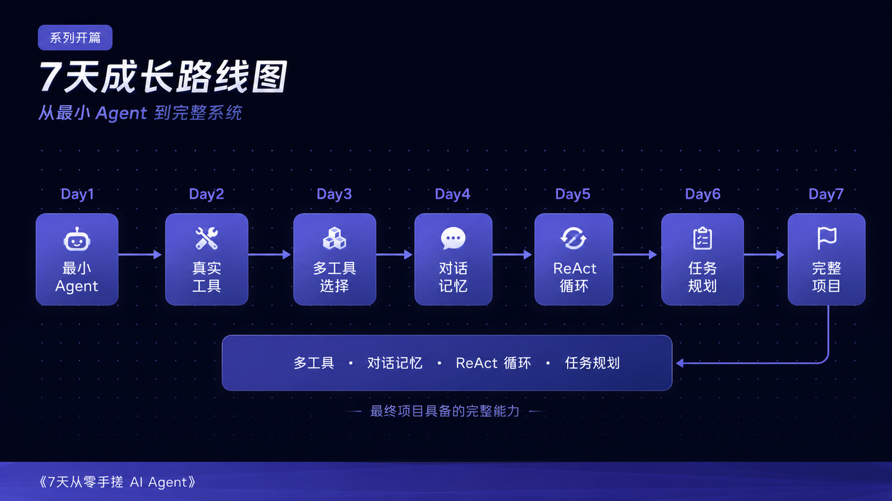
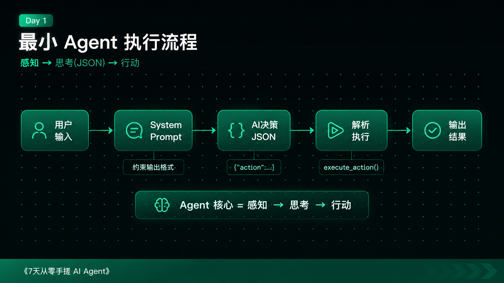
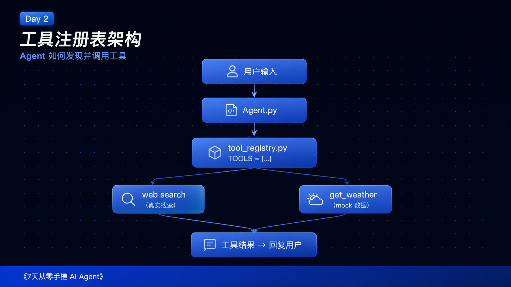
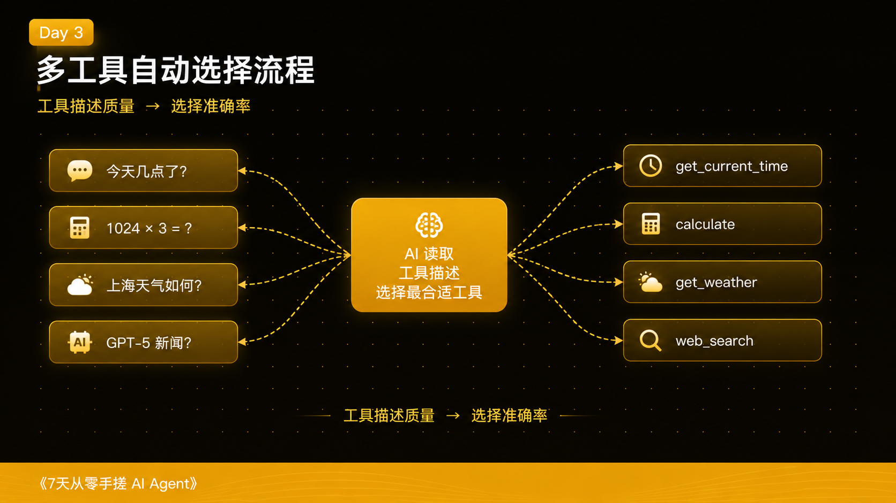
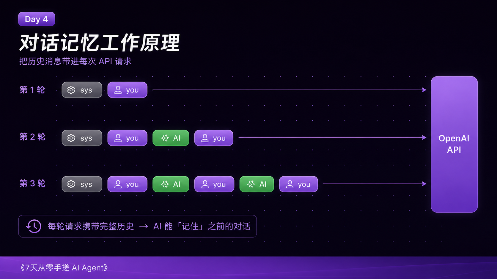
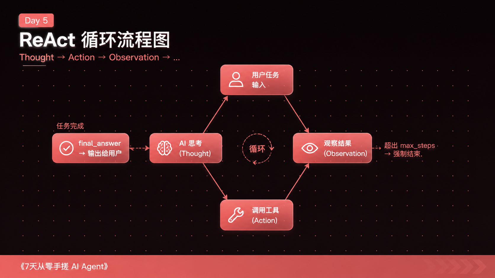
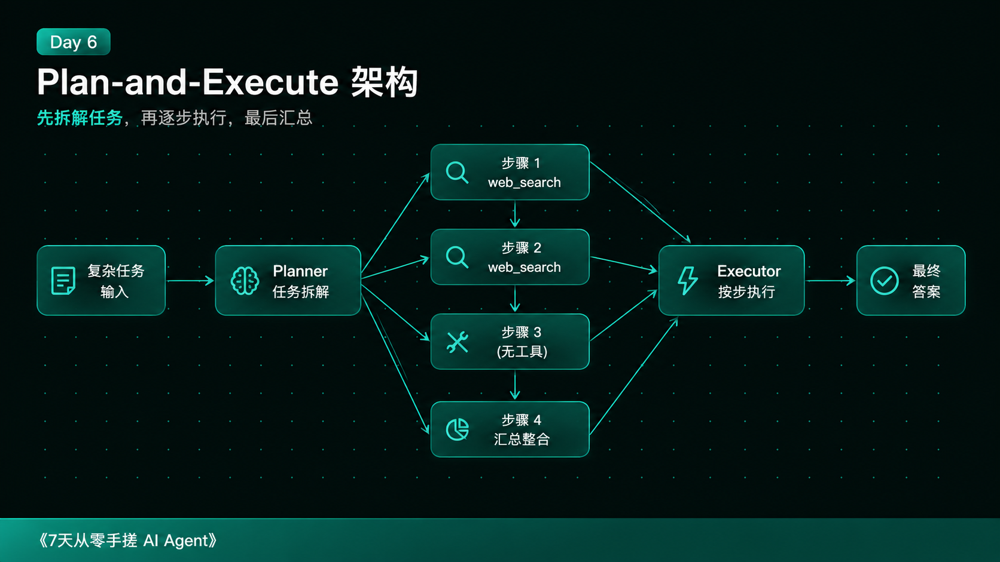
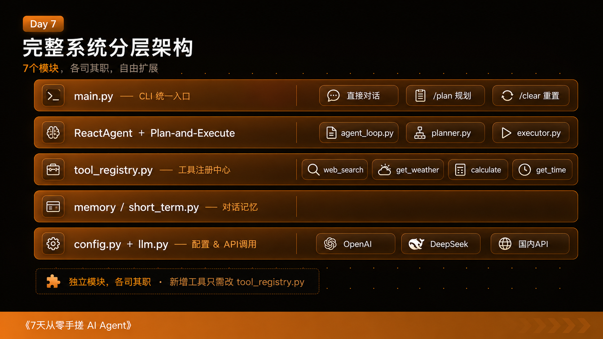

# 我用 7 天从零搭了一个 AI Agent，没用任何框架，学到了这些



---

去年底我开始研究 AI Agent，第一反应是去搜 LangChain。

跟着教程写了一下午，能跑起来，但我完全不明白它在干什么。调个参数，报个错，去查文档，文档里又是一堆新概念。我感觉自己像在开一辆不知道油门在哪里的车——能走，但总觉得随时可能翻。

后来我换了个思路：**不用任何框架，从零开始，一个概念一个概念搞清楚**。

结果花了7天，把一个最小的 Agent 一步步做成了一个能联网、有记忆、能多步推理的系统。这篇文章把这7天的过程全部写下来——不是给你背知识点，是把我当时怎么想、怎么卡住、怎么通了的过程还原出来。

代码全部开源放在 GitHub，文章里的每段代码都是能直接跑的。

---

## Agent 到底是个什么东西

在动手之前，我花了一些时间搞清楚这个问题，因为网上的解释实在太飘了。

"大语言模型驱动的自主智能体"，"具备感知、规划、执行能力的 AI 系统"——这些话看了和没看一样。

我自己的理解是这样的：**Agent 就是一个带工具的 AI，加上一个反复运行的循环**。

普通的 AI 对话是这样的：你问一句，它答一句，结束。

Agent 是这样的：你给它一个任务，它想一想，决定用什么工具，工具跑完拿到结果，再想一想，再决定下一步，直到任务完成。

就这样，没有别的。

那为什么市面上把它讲得这么复杂？一部分是因为真正工业级的 Agent 确实有很多工程细节要处理，另一部分嘛……AI 这行，概念膨胀是有传统的。

我花7天做出来的东西，大概就是一个"能用的最小版本"。它能处理日常的信息查询、计算、多轮对话，面对复杂任务还能先列计划再执行。离真正的 AI 助手还有距离，但它的每一行代码我都能解释清楚，这一点比很多人用 LangChain 做出来的东西强。

---

## Day 1：让 AI 返回 JSON，而不是废话



第一天要做的事情说起来很朴素：**做一个能判断"要不要查天气"的程序**。

用户说"北京今天天气怎么样"，程序去查天气；用户说"1+1等于多少"，程序直接回答。

听起来简单，但有一个关键问题：**你怎么让 AI 的回答能被程序处理？**

AI 默认的回答是自然语言，比如"好的！让我帮您查一下北京的天气……当前北京的天气情况为……"。这对人来说很友好，但程序不知道从哪里提取城市名，不知道要不要去调用天气 API。

解法就是 System Prompt。

```python
SYSTEM_PROMPT = """你是一个智能助手。

当用户问你问题时，判断：是直接回答，还是需要查天气。

你必须用 JSON 格式回复，不能说任何其他话。

如果可以直接回答：
{"action": "answer", "content": "你的回答内容"}

如果需要查天气：
{"action": "get_weather", "city": "城市名"}

只返回 JSON，不要加任何解释、前缀或代码块标记。"""
```

System Prompt 是你在对话开始前给 AI 的"岗前培训"。你告诉它：你只能返回 JSON，就这两种格式，别的别说。

大模型其实非常听话——在绝大多数情况下，它真的会乖乖按这个格式输出。

AI 回来一段 JSON 字符串之后，程序解析它，再决定下一步：

```python
def execute_action(ai_response: str) -> str:
    decision = safe_parse_json(ai_response)
    action = decision.get("action")

    if action == "answer":
        return decision.get("content", "")

    elif action == "get_weather":
        city = decision.get("city", "未知城市")
        weather = get_weather(city)
        return f"{city}的天气：{weather}"
```

逻辑非常清楚：解析 JSON，拿到 `action` 字段，根据值执行不同的分支。

跑起来的效果：

```
你：北京今天天气怎么样？
[AI 决策]: {"action": "get_weather", "city": "北京"}
Agent：北京的天气：晴，15°C，东风3级

你：1+1等于多少？
[AI 决策]: {"action": "answer", "content": "1+1等于2。"}
Agent：1+1等于2。
```

这里有一个小细节值得说：`safe_parse_json` 这个函数。

```python
def safe_parse_json(text: str) -> dict:
    try:
        return json.loads(text)
    except json.JSONDecodeError:
        pass
    # 尝试从文本里找 {...} 块
    match = re.search(r'\{.*\}', text, re.DOTALL)
    if match:
        try:
            return json.loads(match.group())
        except json.JSONDecodeError:
            pass
    return {"action": "answer", "content": text}
```

AI 不是每次都能完美地只输出 JSON，偶尔会在前面加"好的，这是我的回复："之类的废话。这个函数的作用是：先尝试直接解析，失败了就用正则从文本里找 `{...}` 块，还找不到就把原文当成普通回答处理。

**这是第一天最重要的收获：AI 的输出格式由 System Prompt 决定，JSON 格式让 AI 的决策变成程序可以处理的数据。这是 Agent 能"执行动作"的根本原因。**

---

## Day 2：装上第一个真实工具



第一天的天气功能是假数据，写死在代码里的。第二天要做两件事：

1. 接入真实的搜索工具
2. 建立一套可扩展的工具注册机制

搜索工具用的是 DuckDuckGo 的免费 API，不需要申请 Key，直接能用：

```python
from duckduckgo_search import DDGS

def web_search(query: str) -> str:
    try:
        with DDGS() as ddgs:
            results = list(ddgs.text(query, max_results=3))
        if not results:
            return "没有找到相关结果"
        parts = []
        for r in results:
            parts.append(f"标题：{r['title']}\n摘要：{r['body']}\n来源：{r['href']}")
        return "\n\n".join(parts)
    except Exception as e:
        return f"搜索出错：{e}"
```

工具本身很简单，核心在另一个地方——**工具注册表**。

```python
TOOLS = {
    "web_search": {
        "function": web_search,
        "description": "搜索互联网信息。适合查找新闻、事实、最新资讯。",
        "parameters": {"query": "搜索关键词，字符串"},
    },
    "get_weather": {
        "function": get_weather,
        "description": "查询某个城市的天气情况。",
        "parameters": {"city": "城市名称，字符串，例如：北京"},
    },
}
```

一个字典，每个工具有三个字段：函数、描述、参数说明。

这么设计的好处是：**以后想加新工具，只需要写函数 + 加一条记录，Agent 就自动学会用了**。完全不需要动其他代码。

AI 怎么知道它有哪些工具可用？靠 `get_tools_description()`——这个函数把 `TOOLS` 字典里的所有工具描述拼成一段文字，注入到 System Prompt 里：

```python
def get_tools_description() -> str:
    lines = ["你有以下工具可以使用：\n"]
    for name, info in TOOLS.items():
        lines.append(f"工具名：{name}")
        lines.append(f"用途：{info['description']}")
        lines.append(f"参数：{info['parameters']}")
        lines.append("")
    return "\n".join(lines)
```

AI 读到这段说明，就知道"哦，我有 `web_search` 可以用，`get_weather` 可以用"。它选工具的依据，就是这段文字描述。

有一个反直觉的点：**工具描述写得好不好，直接决定 AI 选工具的准确率**。不是模型的问题，是描述的问题。

比如同一个 `calculate` 工具，这样描述：
> 计算数学表达式

和这样描述：
> 计算数学表达式，支持加减乘除和括号。**不适合搜索或文字类问题。**

第二种在遇到模糊问题时，AI 犯错的概率明显低。后半句那个"不适合"是关键——你要帮 AI 划定边界，告诉它什么时候**不能用**这个工具，它才不会乱用。

---

## Day 3：四个工具，让它自己选



第三天新加了计算器和查时间两个工具，Agent 同时拥有四个工具。

```python
TOOLS = {
    "web_search":      { ... },
    "get_weather":     { ... },
    "calculate":       {
        "function": calculate,
        "description": "计算数学表达式，支持加减乘除和括号。不适合搜索或文字类问题。",
        "parameters": {"expression": "数学表达式字符串，例如：(3+5)*2"},
    },
    "get_current_time": {
        "function": get_current_time,
        "description": "获取当前日期和时间。",
        "parameters": {"timezone": "时区名称，字符串，默认 Asia/Shanghai"},
    },
}
```

代码层面没什么变化，就是往字典里加了两条。但这一天值得多说一下工具选择的机制。

AI 怎么选工具？它看 System Prompt 里的工具描述，结合用户的问题，判断用哪个。这个判断不是写死的规则，是大模型的推理能力。

所以说，工具数量增加，并不会让 Agent 变得更难控制——只要每个工具的描述写清楚了，AI 的选择准确率其实挺高的。

测试一下：

```
你：现在几点了？
[AI 决策]: {"action": "use_tool", "tool": "get_current_time", ...}
Agent：2024年03月15日 14:30:22（Asia/Shanghai）

你：(123 + 456) * 2 等于多少？
[AI 决策]: {"action": "use_tool", "tool": "calculate", ...}
Agent：(123 + 456) * 2 = 1158

你：最近有什么 AI 新闻？
[AI 决策]: {"action": "use_tool", "tool": "web_search", ...}
Agent：根据搜索结果……
```

四个问题，四次都选对了。

这一天学到的东西其实更多是工程层面的：**把工具封装成注册表，是一个很好的设计**。以后你想加邮件工具、文件读写工具、数据库查询工具，都是同一个流程：写函数，加一条记录。Agent 的核心逻辑一行不用改。

---

## Day 4：给 Agent 装上记忆



做到这里你可能已经注意到一个问题：每次问完，AI 完全不记得上一轮说了什么。

```
你：我叫小明
Agent：你好！很高兴认识你。

你：我叫什么名字？
Agent：我不知道您的名字……
```

这是 LLM 的本质决定的：API 是无状态的，每次调用对模型来说都是一次全新的对话。

解决方法比你想象的简单：**把历史对话消息拼在新消息前面，一起发给 API**。

```
第1轮：
  发送给 API：[system, user("我叫小明")]
  收到：assistant("你好小明！")

第2轮：
  发送给 API：[system, user("我叫小明"), assistant("你好小明！"), user("我叫什么名字？")]
  收到：assistant("你叫小明。")
```

就这样。记忆的本质是"把历史带进当前请求"，没有魔法。

代码实现用了一个 `ShortTermMemory` 类：

```python
@dataclass
class ShortTermMemory:
    max_messages: int = 20
    _messages: list[Message] = field(default_factory=list)

    def add(self, role: MessageRole, content: str) -> None:
        self._messages.append(Message(role=role, content=content))
        self._trim()

    def _trim(self) -> None:
        """超过上限时，删掉最旧的非 system 消息。"""
        non_system = [m for m in self._messages if m.role != "system"]
        while len(non_system) > self.max_messages:
            for i, msg in enumerate(self._messages):
                if msg.role != "system":
                    self._messages.pop(i)
                    break
            non_system = [m for m in self._messages if m.role != "system"]

    def to_api_format(self) -> list[dict]:
        return [{"role": m.role, "content": m.content} for m in self._messages]
```

`_trim()` 是个关键细节：每条消息都占 token，历史太长会超出模型上限，API 会报错。所以设置了 `max_messages=20`，超出就自动删掉最旧的普通消息——但 `system` 消息永远保留，因为它是 Agent 行为的"宪法"。

有了记忆之后，对话体验明显不一样了：

```
你：我叫小明，我在学习 Python
Agent：你好小明！很高兴认识你。Python 是一门很棒的语言...

你：我刚才说我叫什么名字？
Agent：你说你叫小明，并且正在学习 Python。
```

输入 `/clear` 可以清空记忆，重新开始。这个功能在实现上只是调用 `memory.clear_non_system()`，把所有非 system 消息删掉。

记忆这个问题表面上简单，但有几个地方值得注意：

**第一，记忆越长，每次 API 调用越贵。** 因为每次都要把全部历史发过去。所以 `max_messages` 不能设太大。

**第二，system 消息是用来干嘛的，用户不需要知道。** System Prompt 里有工具描述、行为约束等内容，不该出现在对话历史里。所以 `_trim()` 只删非 system 消息，不动 system。

**第三，"短期记忆"是有意为之的名字。** 后续可以做长期记忆（存到数据库）、向量检索（找相关历史）等，但那是另一个话题了。

---

## Day 5：ReAct 循环——Agent 的灵魂



这是整个7天里最关键的一天，没有之一。

前四天的 Agent 有一个根本限制：**每次对话，最多用一个工具，然后回答**。

但现实中很多任务需要多步骤：搜一下这个，再搜一下那个，把结果综合一下，再回答。这种"多步推理+多次工具调用"的能力，靠的就是 **ReAct 循环**。

ReAct 来自 2022 年的一篇论文，全称是 Reasoning + Acting。核心思路很简单：

```
思考（Thought）→ 行动（Action）→ 观察（Observation）→ 思考 → ...
```

循环，直到任务完成或达到步骤上限。

具体到代码，每次循环 AI 面对三个选择：

```
1. 用工具 (tool_call)   → 还需要更多信息
2. 给答案 (final_answer) → 信息够了，任务完成
3. 问用户 (ask_user)    → 需要人类补充
```

System Prompt 里规定了这个格式：

```python
REACT_SYSTEM_PROMPT = """你是一个能完成复杂任务的智能助手，可以反复使用工具直到任务完成。

{tools_description}

每次回复必须是 JSON，三种格式之一：

1. 需要使用工具：
{{"type": "tool_call", "tool": "工具名", "params": {{"参数名": "参数值"}}, "thought": "我为什么要用这个工具"}}

2. 任务已完成：
{{"type": "final_answer", "content": "最终答案内容"}}

3. 需要向用户提问：
{{"type": "ask_user", "question": "你的问题"}}

规则：
- 最多使用工具 {max_steps} 次
- 收集到足够信息后，必须给出 final_answer
- 不要用相同参数重复调用同一个工具"""
```

循环的核心逻辑：

```python
for step in range(1, self.max_steps + 1):
    ai_response = chat(memory.to_api_format())
    memory.add("assistant", ai_response)
    decision = safe_parse_json(ai_response)
    resp_type = decision.get("type")

    if resp_type == "final_answer":
        return decision.get("content", "")

    if resp_type == "tool_call":
        tool_name = decision.get("tool", "")
        params    = decision.get("params", {})
        result    = execute_tool(tool_name, params)
        # 把工具结果作为新消息加入记忆
        memory.add("user", f"工具 {tool_name} 返回：\n{result}")
        continue   # 回到循环顶部，让 AI 继续思考

    if resp_type == "ask_user":
        answer = input(f"Agent 问你：{decision.get('question', '')}\n你：")
        memory.add("user", answer)
        continue
```

注意 `continue` 那行——工具调用完成后，把结果存进记忆，然后立刻进入下一轮循环，让 AI 拿着工具返回的结果再思考一次。这就是"循环"的关键所在。

跑起来大概是这样：

```
你：帮我搜索最近 AI 领域的新闻，总结出3条最重要的

────────────────────────────────────────
[步骤 1/5]
[AI 思考]: {"type": "tool_call", "tool": "web_search", 
            "params": {"query": "AI 人工智能最新新闻 2024"},
            "thought": "需要先搜索相关新闻"}
[调用工具]: web_search
[工具结果]: 标题：OpenAI 发布 GPT-4o...（后面还有）

────────────────────────────────────────
[步骤 2/5]
[AI 思考]: {"type": "final_answer", 
            "content": "根据搜索结果，以下是3条最重要的 AI 新闻：\n1. ..."}
[任务完成，共 2 步]

Agent：根据搜索结果，以下是3条最重要的 AI 新闻：
1. ...
```

AI 自己决定什么时候收工，没有人告诉它"你现在可以回答了"。

**为什么需要 `max_steps` 上限？**

因为 AI 偶尔会进入一种"总觉得信息不够"的状态，搜完这个搜那个，停不下来。设置 `max_steps=5` 是一个安全阀：最多走5步，到了就强制要求给答案。

这不是 bug，这是工程权衡。你的任务越复杂，就把 `max_steps` 设大一点；简单的问答场景设小一点，省钱。

说实话，我在实现这一块的时候有个小插曲：最初我以为 AI 每次调完工具会"知道"自己调了，不需要再通知它结果。

实际上不是的。你必须把工具的返回值作为新消息加进去（模拟"用户告知 AI 结果"），AI 才能在下一轮用这个信息做决策。这个细节在代码里就是 `memory.add("user", f"工具 {tool_name} 返回：\n{result}")` 那行。

---

## Day 6：先想清楚，再动手



ReAct 循环很好用，但对某类任务有局限：**任务目标很明确、步骤可以提前规划的场景**。

比如"调研 AI 编程工具市场，写一份报告"——这种任务，你一眼就能看出来要先搜这个、再搜那个、最后整合。如果直接扔给 ReAct，它会边走边想，可能会绕弯路，也可能在某一步钻牛角尖出不来。

更好的做法是 **Plan-and-Execute**：先让 AI 想清楚分几步走，确认之后再一步步执行。

第六天加了两个模块：

**`planner.py`**——给定任务，生成执行计划：

```python
def make_plan(task: str) -> Plan:
    prompt = f"""
    任务：{task}

    请将任务分解为 3-6 个可执行的步骤。
    每个步骤说明：这步要做什么，以及用什么工具（如果需要工具的话）。
    如果某步不需要工具，tool 字段填 null。

    返回 JSON 格式：
    {{
      "goal": "任务目标",
      "steps": [
        {{"step": 1, "description": "...", "tool": "工具名或null"}}
      ]
    }}
    """
    ...
```

**`executor.py`**——按计划一步步执行，每步结果汇总：

```python
def execute_plan(plan: Plan) -> str:
    results = []
    for step in plan.steps:
        if step.tool:
            result = execute_tool(step.tool, {"query": step.description})
        else:
            result = ask_llm_to_summarize(step.description, results)
        results.append(f"步骤{step.step}：{result}")
    return summarize_all(results, plan.goal)
```

用起来是这样：

```
你：/plan 帮我调研 AI 编程工具的现状，写一份简要报告

正在制定计划...

目标：调研 AI 编程工具现状并生成报告
共 3 步：
  步骤 1：搜索主流 AI 编程工具  （工具：web_search）
  步骤 2：搜索各工具的用户评价  （工具：web_search）
  步骤 3：整合信息，撰写报告    （无需工具）

确认执行？(y/n)：y

开始执行…
步骤 1 完成 ✓
步骤 2 完成 ✓
步骤 3 完成 ✓

Agent：
## AI 编程工具现状报告

### 主要工具
1. GitHub Copilot：...
2. Cursor：...
```

在我看来，Plan-and-Execute 和 ReAct 是互补的，不是替代关系：

| 场景 | 推荐模式 |
|------|---------|
| 问答、聊天、单次查询 | ReAct（直接用工具） |
| 需要多步骤、有明确目标的研究任务 | Plan-and-Execute（先规划） |
| 任务边界不清晰、需要边探索边决定 | ReAct（更灵活） |

两种模式在最终版本里都保留了，用 `/plan` 命令切换。

---

## Day 7：把所有东西整合在一起



第七天没有新功能，就是把前六天的东西整合成一个结构清晰的完整项目。

最终的目录结构：

```
final_project/
├── main.py           ← 统一入口，CLI 交互
├── config.py         ← 配置管理和启动检查
├── llm.py            ← AI 调用封装
├── agent_loop.py     ← ReAct 循环
├── planner.py        ← 任务规划
├── executor.py       ← 计划执行
├── tool_registry.py  ← 工具注册中心
├── memory/
│   └── short_term.py ← 短期记忆
└── tools/
    ├── search.py
    ├── weather.py
    ├── calculator.py
    └── datetime_tool.py
```

`main.py` 是整个系统的入口，处理命令行交互：

```python
def main() -> None:
    load_config()
    print(BANNER)
    agent = ReactAgent(max_steps=5)

    while True:
        user_input = input("你：").strip()
        if not user_input:
            continue
        if user_input.lower() in ("/quit", "/exit"):
            break
        if user_input.startswith("/plan "):
            task = user_input[6:].strip()
            plan = make_plan(task)
            print_plan(plan)
            if input("\n确认执行？(y/n)：").strip().lower() == "y":
                result = execute_plan(plan)
                print(f"\nAgent：{result}")
        elif user_input == "/clear":
            agent.clear_memory()
            print("记忆已清除。")
        else:
            result = agent.run(user_input)
            print(f"\nAgent：{result}")
```

整个系统跑起来就是这样：

```
=================================================
    我的 AI Agent 系统 v1.0
=================================================
命令：
  直接输入     → 对话模式（有记忆，自动使用工具）
  /plan <任务> → 规划模式（先制定计划再执行）
  /clear       → 清除对话记忆
  /quit        → 退出
=================================================

你：帮我搜索一下最近 Cursor 的新功能

[步骤 1/5]
[AI 思考]: {"type": "tool_call", "tool": "web_search", ...}
[工具结果]: ...

[步骤 2/5]
[AI 思考]: {"type": "final_answer", "content": "..."}

Agent：根据最新搜索结果，Cursor 最近发布了……
```

这一天主要做的是让代码"好看"——每个文件的职责单一，模块之间的依赖关系清晰，新增工具或者改配置的时候只需要动一个地方。

---

## 七天的代码结构怎么演进的

回过头来看整个7天的进化路径，其实是一条很清晰的线：

**Day 1**：一个 `agent.py`，一个 `actions.py`，用 System Prompt 让 AI 返回 JSON，程序解析 JSON 执行动作。能力：判断要不要查天气。

**Day 2**：加了 `tool_registry.py`。工具不再写死在代码里，而是放在一个字典里，AI 通过描述文字来知道有哪些工具可用。能力：用真实搜索工具联网。

**Day 3**：扩展 `tool_registry.py`，加了计算器和查时间工具。没改其他代码，Agent 就自动会用四个工具了。能力：多工具自动选择。

**Day 4**：加了 `memory/short_term.py`，把对话历史作为数组传给 API。能力：多轮对话不失忆。

**Day 5**：加了 `agent_loop.py`，引入 ReAct 循环，AI 可以反复思考和调用工具，直到任务完成。能力：多步骤自主完成任务。

**Day 6**：加了 `planner.py` 和 `executor.py`，实现 Plan-and-Execute 模式。能力：先规划再执行，适合结构化任务。

**Day 7**：整合，统一入口，清理代码结构。

每一步都只新增了必要的东西，前一天的代码几乎不需要大改。这是这个项目最让我满意的地方——它是真正"生长"出来的，不是一开始就设计好一个复杂的系统。

---

## 跑起来需要什么

整个项目的依赖很少：

```
openai>=1.0
python-dotenv
duckduckgo-search
```

Python 要 3.10 以上（因为用了 `str | None` 类型注解）。

API Key 方面，推荐两个选择：

**OpenAI（效果最好）：** 去 [platform.openai.com](https://platform.openai.com) 注册，跑完7天课程大概花不到5块钱（用 gpt-4o-mini）。

**DeepSeek（国内，不用梯子）：** 效果跟 GPT-4 差不多，价格便宜很多。修改 `llm.py` 里的两个地方就能切换：

```python
client = OpenAI(
    api_key=os.environ["OPENAI_API_KEY"],
    base_url="https://api.deepseek.com",   # 改这里
)

# chat 函数里：
response = client.chat.completions.create(
    model="deepseek-chat",                 # 改这里
    ...
)
```

`.env` 文件里填入 DeepSeek 的 Key，其他不用动。

---

## 和 LangChain 相比，这个项目有什么价值

可能有人会问：我直接用 LangChain 不是更省事吗，为什么要从零写？

我觉得这两件事不冲突，但有先后顺序的问题。

用 LangChain 建一个能跑的 Agent，一下午就够。但你不会知道"工具注册表为什么这样设计"，不会知道"ReAct 循环里那个 continue 是干什么的"，不会知道"为什么工具结果要作为 user 消息传回去而不是 assistant 消息"。

这些细节你在 LangChain 里永远不需要关心，直到某一天它出了你看不懂的 bug，或者你需要做一个框架不支持的定制功能。

从零写一遍的价值，是**建立起真正的直觉**。之后再用 LangChain，你看每一个抽象层都知道它在封装什么，哪里可以替换，哪里是死路。

就像学开车，你不一定要先学发动机原理，但如果你真的学过，你对这辆车的掌控感是完全不一样的。

---

## 还可以往哪里走

7天做完的这个系统还很简陋，有很多显而易见的扩展方向。

**加更多工具**是最直接的。工具注册表的设计让加工具非常简单——发邮件（`smtplib`）、读写本地文件、查数据库、调用任意 HTTP API，都是同一个套路：写一个函数，往 `TOOLS` 字典里加一条。

**记忆系统升级**是另一个方向。现在的短期记忆只保留最近20条消息，关掉程序就全丢了。更实用的方向是长期记忆——把对话历史写入数据库，下次启动还能找回来。再进一步，可以加向量检索，不是找"最近的"消息，而是找"相关的"消息——这就是很多 RAG 系统的核心思路。

**做界面**是为了让非技术用户也能用。最简单的做法是 FastAPI + 一个 HTML 页面，几十行代码就能把命令行 Agent 变成一个本地 Web 应用。或者接 Telegram Bot，更方便分享给别人用。

**探索多 Agent 协作**是更高级的方向。一个 Agent 负责搜索，一个负责总结，一个负责写代码，互相传递任务——这是 AutoGen、CrewAI 这类框架在做的事情。现在你理解了单个 Agent 的工作原理，再去看这些系统就不会发蒙了。

---

## 最后说一句

其实这篇文章里的技术，没有一样是新的。ReAct 是 2022 年的论文，工具调用的思路更早。大模型厂商和框架把这些概念包装得越来越复杂，但核心就是那几件事：

- 用 System Prompt 约束 AI 输出格式
- 用 JSON 作为 AI 和程序之间的接口
- 循环：AI 思考 → 调工具 → 看结果 → 再思考
- 记忆：把历史塞进请求里带过去

搞清楚这几件事，你就掌握了现在市面上大多数 Agent 产品的底层逻辑。

代码在这里，全部开源，随便用：
> github.com/kris330/my-first-agent

如果你跑起来遇到问题，项目里有 `docs/common_errors.md`，10种最常见的错误和解决方法都在那里。

---

*写完突然想到，我在 Day 1 到 Day 5 之间犯了一个错：我以为工具调用完成后 AI 会"自动知道"结果，完全没想到要把结果作为新消息传回去。结果 ReAct 循环一跑起来，AI 每次都像失忆了一样，明明调了搜索，下一步还是不知道搜到了什么。*

*排查了一个多小时，最后发现就是少了一行 `memory.add("user", result)` 。*

*这就是从零写的好处——你会亲自掉进每一个坑，然后真正明白那个坑存在的原因。*
